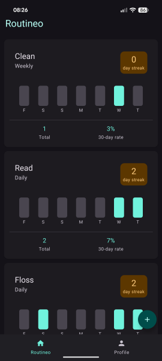
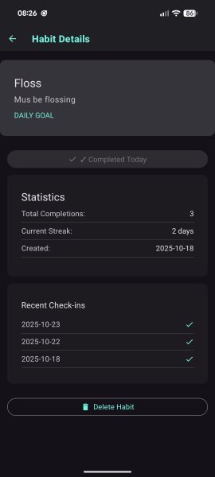

# Routineo

A React Native habit tracking app with TypeScript, Expo, and Firebase.

## Features

- 🔐 Authentication & user management
- ✅ Create & track habits with different frequencies  
- 📊 Visual progress charts & streak tracking
- 💾 Real-time sync with Firebase

## Screenshots

   

## Quick Start

1. **Setup Firebase**
   - Create project at [Firebase Console](https://console.firebase.google.com/)
   - Enable Email/Password authentication
   - Create Firestore database

2. **Environment Config**

   ```bash
   cp .env.example .env
   # Edit .env with your Firebase config
   ```

3. **Install & Run**

   ```bash
   npm install
   npm start
   ```

## Tech Stack

- **Frontend**: React Native + TypeScript + Expo
- **Backend**: Firebase (Auth + Firestore)
- **UI**: Material Design 3 with dynamic theming

## Environment Variables

Required in `.env`:

```env
EXPO_PUBLIC_FIREBASE_API_KEY=your_key
EXPO_PUBLIC_FIREBASE_AUTH_DOMAIN=project.firebaseapp.com
EXPO_PUBLIC_FIREBASE_PROJECT_ID=your_project_id
EXPO_PUBLIC_FIREBASE_STORAGE_BUCKET=project.firebasestorage.app
EXPO_PUBLIC_FIREBASE_MESSAGING_SENDER_ID=sender_id
EXPO_PUBLIC_FIREBASE_APP_ID=app_id
```
